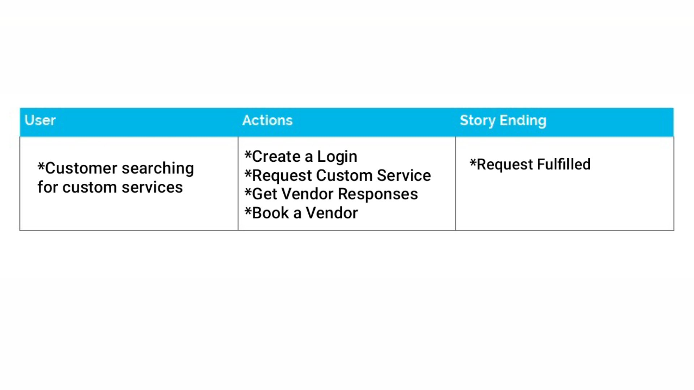

 # AMAZONISLES
 https://afternoon-harbor-43363.herokuapp.com/
 
 
 
## SUMMARY 
Upon secure login: 

This react app allows customers to: 
* Request a unique or one-of-a kind custom service
* Have their request sent to vendors 
* Have their request fulfilled in a timely manner 
* Pay vendors digitally   

This App also allows vendors to: 
* Promote a unique or one-of-a kind custom service
* Find new customers in need of their unique services
* Fulfill customer requests 
* Secure payments digitally

## USER EXPERIENCE: 

###### CUSTOMER:  
* Sarah needs a custom made ball gown but she is having a hard time finding a custom tailor 
who is trustworthy or reliable. 
* Sarah uses this app and is contacted by several vendors who can complete 
the job on time and for a reasonable price. She picks a vendor and receives her ball gown in time for her big event.  She pays the vendor electronically and leaves feedback about the vendor for future users. 

###### VENDOR: 
* Gustav is a custom tailor but his unique skill is underutilized because of a lack of customers & exposure. 
Gustav hopes to earn extra money by utilizing his unique skill and finding clients who may not find him organically. 
He also wants to access reliable clients who can pay him electronically because late check invoice payments have been a problem in the past. 
* Gustav created a vendor profile on this app. He was given high ratings by customers and 
was soon bombarded with requests. Gustav only signs up for the requests he can fulfill in a timely manner. Trustworthy clients easily pay him digitally for his services. 

## LONG TERM PLANS : 
* 100,000 active monthly users.
* Reducing search time for custom services.
* Creating a secure space for clients and providers to connect. 
* Reaching $1 million in monthly transactions via the app.

**Artwork By Ann Tuck 

## TECHNOLOGIES USED: 
HTML, CSS, BOOTSTRAP, REACT, MONGO, HEROKU, REST API'S, JAVASCRIPT, NODE.JS, EXPRESS 

## WEB DEVELOPERS : 

 
*Makiko Vaughan     
https://github.com/makikovaughan 

 
*Rachida Kone   
https://github.com/RachidaSK

 
*Anna Nichols   
https://github.com/anicho91

 
*Cynthia Knox   
https://github.com/cindy046

 
*Ann Tuck       
https://github.com/AnnTuck	

**Artwork By Ann Tuck 

